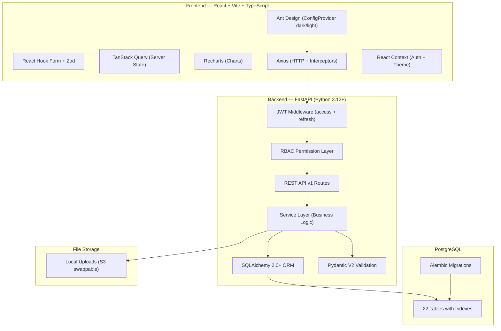

# BuildFlow ERP — Implementation Plan

A production-ready Construction ERP and Real Estate Management System built with React + TypeScript + Vite (frontend) and FastAPI + SQLAlchemy + PostgreSQL (backend).

---

## Skills Applied from `antigravity-awesome-skills`

> [!NOTE]
> The following 18 skills were studied and will be applied throughout implementation:

| # | Skill | Applied To |
|---|-------|------------|
| 1 | `fastapi-pro` | Async-first FastAPI, Pydantic V2, dependency injection, custom exception handlers |
| 2 | `python-pro` | Python 3.12+, type hints, SOLID patterns, structured logging |
| 3 | `python-fastapi-development` | Full workflow — project setup → auth → error handling → testing → deployment |
| 4 | `react-best-practices` | Eliminating waterfalls, bundle optimization, re-render optimization, JS performance |
| 5 | `react-patterns` | Component design (presentational/container), hooks, composition, TypeScript typing |
| 6 | `react-state-management` | TanStack Query for server state, React Context for auth/theme (no Redux needed) |
| 7 | `frontend-design` | Distinctive, production-grade interfaces — not generic layouts. Industrial-utilitarian aesthetic |
| 8 | `frontend-api-integration-patterns` | Centralized API layer, race-safe state, AbortController, retry with backoff, debounced search |
| 9 | `database-design` | Schema normalization, UUID PKs, timestamp strategy, relationship types, FK ON DELETE |
| 10 | `postgresql` | TIMESTAMPTZ, NUMERIC for money, TEXT not VARCHAR, FK indexes (manual!), composite indexes |
| 11 | `api-design-principles` | RESTful design, resource modeling, pagination, error strategy, versioning |
| 12 | `api-security-best-practices` | JWT with short-lived tokens, RBAC, input validation with Zod, secure headers, rate limiting |
| 13 | `auth-implementation-patterns` | JWT access + refresh tokens, RBAC, permission enforcement, audit logging |
| 14 | `clean-code` | Meaningful names, small functions, SRP, no side effects, FIRST test principles |
| 15 | `error-handling-patterns` | Custom exceptions, graceful failures, structured error responses |
| 16 | `architecture` | Simplicity-first, trade-off analysis, layered architecture (routes → services → ORM) |
| 17 | `kpi-dashboard-design` | KPI card layout (5-7 max), trend indicators, chart hierarchy, drilldown pattern |
| 18 | `high-end-visual-design` | Premium, dark-mode-first UI with enterprise-grade polish |

---

## 1. Architecture Overview



---

## 2. Database Schema & ER Diagram

> [!IMPORTANT]
> **PostgreSQL skill applied**: Using `TIMESTAMPTZ` (not `TIMESTAMP`), `NUMERIC` for money (not `FLOAT`), `TEXT` (not `VARCHAR`), and explicit FK indexes. UUIDs as PKs for distributed-safe IDs.

### 2.1 Entity Relationship Diagram

```mermaid
erDiagram
    USERS ||--o{ AUDIT_LOGS : creates
    USERS ||--o{ NOTIFICATIONS : receives
    USERS {
        uuid id PK
        text email UK
        text password_hash
        text full_name
        text role "admin|accountant|sales|manager"
        boolean is_active
        timestamptz created_at
        timestamptz updated_at
    }

    PROJECTS ||--o{ PROJECT_EXPENSES : has
    PROJECTS ||--o{ PROJECT_DOCUMENTS : has
    PROJECTS ||--o{ CONTRACTOR_PAYMENTS : has
    PROJECTS ||--o{ PROPERTY_UNITS : contains
    PROJECTS {
        uuid id PK
        text name
        text description
        numeric budget
        numeric spent
        text status "planning|in_progress|on_hold|completed|cancelled"
        date start_date
        date end_date
        int progress_percent
        text location
        uuid created_by FK
        timestamptz created_at
        timestamptz updated_at
    }

    PROJECT_EXPENSES {
        uuid id PK
        uuid project_id FK
        text expense_type "material|labor|equipment|overhead|other"
        text description
        numeric amount
        date expense_date
        text vendor_name
        text receipt_url
        uuid created_by FK
        timestamptz created_at
    }

    PROJECT_DOCUMENTS {
        uuid id PK
        uuid project_id FK
        text title
        text file_url
        text file_type
        bigint file_size
        uuid uploaded_by FK
        timestamptz created_at
    }

    CONTRACTORS ||--o{ CONTRACTOR_PAYMENTS : receives
    CONTRACTORS {
        uuid id PK
        text name
        text phone
        text email
        text specialty
        text bank_details
        boolean is_active
        timestamptz created_at
        timestamptz updated_at
    }

    CONTRACTOR_PAYMENTS {
        uuid id PK
        uuid contractor_id FK
        uuid project_id FK
        numeric amount
        date payment_date
        date due_date
        text status "pending|paid|overdue|cancelled"
        text notes
        uuid approved_by FK
        timestamptz created_at
    }

    EMPLOYEES ||--o{ SALARY_PAYMENTS : receives
    EMPLOYEES {
        uuid id PK
        text name
        text phone
        text email
        text designation
        text department
        numeric base_salary
        date joining_date
        boolean is_active
        timestamptz created_at
        timestamptz updated_at
    }

    SALARY_PAYMENTS {
        uuid id PK
        uuid employee_id FK
        numeric amount
        numeric deductions
        numeric bonus
        numeric net_amount
        text month_year
        date payment_date
        text status "pending|paid"
        timestamptz created_at
    }

    OFFICE_EXPENSES {
        uuid id PK
        text category "rent|utilities|supplies|maintenance|misc"
        text description
        numeric amount
        date expense_date
        text receipt_url
        uuid created_by FK
        timestamptz created_at
    }

    INVESTMENTS ||--o{ INVESTMENT_DOCUMENTS : has
    INVESTMENTS ||--o{ INVESTMENT_PAYMENTS : has
    INVESTMENTS {
        uuid id PK
        text property_name
        text property_type
        text location
        numeric total_value
        numeric amount_paid
        numeric remaining_balance
        date purchase_date
        text status "active|sold|cancelled"
        text notes
        uuid created_by FK
        timestamptz created_at
        timestamptz updated_at
    }

    INVESTMENT_DOCUMENTS {
        uuid id PK
        uuid investment_id FK
        text title
        text file_url
        text file_type
        bigint file_size
        uuid uploaded_by FK
        timestamptz created_at
    }

    INVESTMENT_PAYMENTS {
        uuid id PK
        uuid investment_id FK
        numeric amount
        date payment_date
        date due_date
        text payment_type "receivable|payable"
        text status "pending|received|paid|overdue"
        text notes
        timestamptz created_at
    }

    PROPERTY_UNITS ||--o{ PROPERTY_SALES : sold_via
    PROPERTY_UNITS {
        uuid id PK
        uuid project_id FK
        text unit_number
        text unit_type
        numeric area_sqft
        numeric price
        text status "available|reserved|sold"
        text floor
        text description
        timestamptz created_at
        timestamptz updated_at
    }

    CUSTOMERS ||--o{ PROPERTY_SALES : buys
    CUSTOMERS {
        uuid id PK
        text name
        text phone
        text email
        text cnic
        text address
        text notes
        timestamptz created_at
        timestamptz updated_at
    }

    PROPERTY_SALES ||--o{ INSTALLMENT_SCHEDULES : has
    PROPERTY_SALES ||--o{ SALE_DOCUMENTS : has
    PROPERTY_SALES {
        uuid id PK
        uuid property_id FK
        uuid customer_id FK
        numeric total_price
        numeric discount
        numeric net_price
        numeric amount_paid
        numeric outstanding_balance
        date sale_date
        date agreement_date
        text status "active|completed|cancelled"
        uuid created_by FK
        timestamptz created_at
        timestamptz updated_at
    }

    INSTALLMENT_SCHEDULES {
        uuid id PK
        uuid sale_id FK
        int installment_number
        numeric amount
        date due_date
        date paid_date
        text status "pending|paid|overdue|partial"
        numeric paid_amount
        text notes
        timestamptz created_at
    }

    SALE_DOCUMENTS {
        uuid id PK
        uuid sale_id FK
        text title
        text file_url
        text file_type
        bigint file_size
        uuid uploaded_by FK
        timestamptz created_at
    }

    LOANS {
        uuid id PK
        text loan_type "lent|borrowed"
        text party_name
        text party_phone
        numeric principal_amount
        numeric amount_paid
        numeric outstanding_balance
        numeric interest_rate
        date loan_date
        date due_date
        text status "active|settled|defaulted"
        text notes
        uuid created_by FK
        timestamptz created_at
        timestamptz updated_at
    }

    LOANS ||--o{ LOAN_PAYMENTS : has
    LOAN_PAYMENTS {
        uuid id PK
        uuid loan_id FK
        numeric amount
        date payment_date
        text notes
        uuid recorded_by FK
        timestamptz created_at
    }

    DOCUMENTS {
        uuid id PK
        text title
        text category
        text file_url
        text file_type
        bigint file_size
        text tags
        uuid entity_id
        text entity_type
        uuid uploaded_by FK
        timestamptz created_at
    }

    AUDIT_LOGS {
        uuid id PK
        uuid user_id FK
        text action
        text entity_type
        uuid entity_id
        jsonb old_values
        jsonb new_values
        text ip_address
        timestamptz created_at
    }

    NOTIFICATIONS {
        uuid id PK
        uuid user_id FK
        text title
        text message
        text type "info|warning|success|error"
        boolean is_read
        text link
        timestamptz created_at
    }
```



### 2.2 Indexing Strategy (per `postgresql` + `database-design` skills)

| Table | Indexes |
|-------|---------|
| `users` | PK(`id`), UNIQUE(`email`), `LOWER(email)` expression index |
| `projects` | PK(`id`), `created_by` FK, `status`, `created_at` |
| `project_expenses` | PK(`id`), `project_id` FK, `expense_date`, `expense_type` |
| `project_documents` | PK(`id`), `project_id` FK |
| `contractors` | PK(`id`), `is_active` |
| `contractor_payments` | PK(`id`), `contractor_id` FK, `project_id` FK, `status`, `due_date` |
| `employees` | PK(`id`), `is_active` |
| `salary_payments` | PK(`id`), `employee_id` FK, `month_year` |
| `office_expenses` | PK(`id`), `expense_date`, `category` |
| `investments` | PK(`id`), `status`, `created_at` |
| `investment_payments` | PK(`id`), `investment_id` FK, `due_date`, `status` |
| `property_units` | PK(`id`), `project_id` FK, `status` |
| `customers` | PK(`id`), `phone`, `cnic` |
| `property_sales` | PK(`id`), `property_id` FK, `customer_id` FK, `status` |
| `installment_schedules` | PK(`id`), `sale_id` FK, `due_date`, `status` |
| `loans` | PK(`id`), `loan_type`, `status` |
| `loan_payments` | PK(`id`), `loan_id` FK |
| `documents` | PK(`id`), `entity_type` + `entity_id` composite, `category` |
| `audit_logs` | PK(`id`), `user_id` FK, `entity_type` + `entity_id` composite, `created_at` |
| `notifications` | PK(`id`), `user_id` FK, `is_read`, `created_at` |

---

## 3. API Routes

### 3.1 Authentication

| Method | Endpoint | Description |
|--------|----------|-------------|
| POST | `/api/v1/auth/login` | Login, returns JWT access + refresh |
| POST | `/api/v1/auth/register` | Register new user (admin only) |
| POST | `/api/v1/auth/refresh` | Refresh access token |
| GET | `/api/v1/auth/me` | Get current user profile |
| PUT | `/api/v1/auth/change-password` | Change password |

### 3.2 Dashboard

| Method | Endpoint | Description |
|--------|----------|-------------|
| GET | `/api/v1/dashboard/kpis` | KPI summary cards (5-7 cards) |
| GET | `/api/v1/dashboard/revenue-summary` | Revenue data for charts |
| GET | `/api/v1/dashboard/expense-summary` | Expense breakdown |
| GET | `/api/v1/dashboard/recent-activity` | Recent activity feed |
| GET | `/api/v1/dashboard/payment-reminders` | Upcoming payment reminders |
| GET | `/api/v1/dashboard/project-overview` | Active projects overview |

### 3.3 Projects

| Method | Endpoint | Description |
|--------|----------|-------------|
| GET | `/api/v1/projects` | List projects (paginated, filterable) |
| POST | `/api/v1/projects` | Create project |
| GET | `/api/v1/projects/{id}` | Get project detail |
| PUT | `/api/v1/projects/{id}` | Update project |
| DELETE | `/api/v1/projects/{id}` | Soft delete project |
| GET | `/api/v1/projects/{id}/expenses` | Project expenses |
| POST | `/api/v1/projects/{id}/expenses` | Add expense |
| GET | `/api/v1/projects/{id}/documents` | Project documents |
| POST | `/api/v1/projects/{id}/documents` | Upload document |
| GET | `/api/v1/projects/{id}/contractors` | Project contractor payments |
| GET | `/api/v1/projects/{id}/report` | Project-specific report |

### 3.4 Contractors

| Method | Endpoint | Description |
|--------|----------|-------------|
| GET | `/api/v1/contractors` | List contractors |
| POST | `/api/v1/contractors` | Create contractor |
| GET | `/api/v1/contractors/{id}` | Contractor detail |
| PUT | `/api/v1/contractors/{id}` | Update contractor |
| DELETE | `/api/v1/contractors/{id}` | Delete contractor |
| GET | `/api/v1/contractors/{id}/payments` | Payment history |
| POST | `/api/v1/contractors/{id}/payments` | Record payment |

### 3.5 Office Management

| Method | Endpoint | Description |
|--------|----------|-------------|
| CRUD | `/api/v1/employees` | Employee management |
| CRUD | `/api/v1/employees/{id}/salaries` | Salary payments |
| CRUD | `/api/v1/office-expenses` | Office expenses |

### 3.6 Investments

| Method | Endpoint | Description |
|--------|----------|-------------|
| CRUD | `/api/v1/investments` | Investment properties |
| CRUD | `/api/v1/investments/{id}/documents` | Investment documents |
| CRUD | `/api/v1/investments/{id}/payments` | Payment receivables/payables |

### 3.7 Property Sales

| Method | Endpoint | Description |
|--------|----------|-------------|
| CRUD | `/api/v1/property-units` | Property inventory |
| CRUD | `/api/v1/customers` | Customer management |
| CRUD | `/api/v1/sales` | Property sales |
| GET | `/api/v1/sales/{id}/installments` | Installment schedule |
| PUT | `/api/v1/sales/{id}/installments/{inst_id}` | Update installment |
| POST | `/api/v1/sales/{id}/installments/{inst_id}/pay` | Record installment payment |
| GET | `/api/v1/customers/{id}/history` | Customer purchase history |

### 3.8 Tuesday Payment Generator

| Method | Endpoint | Description |
|--------|----------|-------------|
| GET | `/api/v1/tuesday-payments` | Get pending payments for next Tuesday |
| GET | `/api/v1/tuesday-payments/generate` | Generate payment summary |
| GET | `/api/v1/tuesday-payments/export/excel` | Download as Excel |
| GET | `/api/v1/tuesday-payments/export/pdf` | Download as PDF |

### 3.9 Loans

| Method | Endpoint | Description |
|--------|----------|-------------|
| CRUD | `/api/v1/loans` | Loan management |
| GET | `/api/v1/loans/{id}/payments` | Loan payment history |
| POST | `/api/v1/loans/{id}/payments` | Record loan payment |

### 3.10 Reports

| Method | Endpoint | Description |
|--------|----------|-------------|
| GET | `/api/v1/reports/monthly` | Monthly report |
| GET | `/api/v1/reports/yearly` | Yearly report |
| GET | `/api/v1/reports/project/{id}` | Project report |
| GET | `/api/v1/reports/investment/{id}` | Investment report |
| GET | `/api/v1/reports/expenses` | Expense report |
| GET | `/api/v1/reports/office-expenses` | Office expense report |
| GET | `/api/v1/reports/export/excel` | Export as Excel |
| GET | `/api/v1/reports/export/pdf` | Export as PDF |

### 3.11 Documents

| Method | Endpoint | Description |
|--------|----------|-------------|
| GET | `/api/v1/documents` | List all documents |
| POST | `/api/v1/documents/upload` | Upload document |
| GET | `/api/v1/documents/{id}` | Get document |
| DELETE | `/api/v1/documents/{id}` | Delete document |
| GET | `/api/v1/documents/search` | Search documents |

### 3.12 User Management

| Method | Endpoint | Description |
|--------|----------|-------------|
| CRUD | `/api/v1/users` | User management (admin) |
| GET | `/api/v1/users/{id}/permissions` | Get user permissions |
| PUT | `/api/v1/users/{id}/permissions` | Update permissions |

### 3.13 Notifications, Audit & Search

| Method | Endpoint | Description |
|--------|----------|-------------|
| GET | `/api/v1/notifications` | List notifications |
| PUT | `/api/v1/notifications/{id}/read` | Mark as read |
| PUT | `/api/v1/notifications/read-all` | Mark all as read |
| GET | `/api/v1/audit-logs` | List audit logs (admin) |
| GET | `/api/v1/search` | Global search |

---

## 4. Folder Structure

### 4.1 Backend (`/backend`)

```
backend/
├── alembic/                    # DB migrations (safe migration strategy)
│   ├── versions/
│   └── env.py
├── app/
│   ├── __init__.py
│   ├── main.py                 # FastAPI app entry + lifespan events
│   ├── config.py               # Pydantic Settings (env vars)
│   ├── database.py             # Async engine + session factory
│   ├── dependencies.py         # Shared DI dependencies
│   ├── models/                 # SQLAlchemy 2.0 declarative models
│   │   ├── __init__.py
│   │   ├── base.py             # Base model with id, timestamps
│   │   ├── user.py
│   │   ├── project.py
│   │   ├── contractor.py
│   │   ├── employee.py
│   │   ├── investment.py
│   │   ├── property.py
│   │   ├── customer.py
│   │   ├── sale.py
│   │   ├── loan.py
│   │   ├── document.py
│   │   ├── notification.py
│   │   └── audit_log.py
│   ├── schemas/                # Pydantic V2 request/response models
│   │   ├── __init__.py
│   │   ├── auth.py
│   │   ├── user.py
│   │   ├── project.py
│   │   ├── contractor.py
│   │   ├── employee.py
│   │   ├── investment.py
│   │   ├── property.py
│   │   ├── customer.py
│   │   ├── sale.py
│   │   ├── loan.py
│   │   ├── document.py
│   │   ├── dashboard.py
│   │   ├── report.py
│   │   └── common.py           # PaginatedResponse, ErrorResponse
│   ├── api/
│   │   ├── __init__.py
│   │   └── v1/
│   │       ├── __init__.py
│   │       ├── router.py       # Aggregates all v1 routes
│   │       ├── auth.py
│   │       ├── dashboard.py
│   │       ├── projects.py
│   │       ├── contractors.py
│   │       ├── employees.py
│   │       ├── office_expenses.py
│   │       ├── investments.py
│   │       ├── property_units.py
│   │       ├── customers.py
│   │       ├── sales.py
│   │       ├── tuesday_payments.py
│   │       ├── loans.py
│   │       ├── reports.py
│   │       ├── documents.py
│   │       ├── users.py
│   │       ├── notifications.py
│   │       ├── audit_logs.py
│   │       └── search.py
│   ├── services/               # Business logic (SRP, one service per domain)
│   │   ├── __init__.py
│   │   ├── auth_service.py
│   │   ├── dashboard_service.py
│   │   ├── project_service.py
│   │   ├── contractor_service.py
│   │   ├── employee_service.py
│   │   ├── investment_service.py
│   │   ├── sale_service.py
│   │   ├── tuesday_payment_service.py
│   │   ├── loan_service.py
│   │   ├── report_service.py
│   │   ├── document_service.py
│   │   ├── notification_service.py
│   │   └── audit_service.py
│   ├── core/
│   │   ├── __init__.py
│   │   ├── security.py         # JWT creation/verification, password hashing
│   │   ├── permissions.py      # RBAC decorator + permission matrix
│   │   ├── exceptions.py       # Custom HTTPExceptions with error codes
│   │   └── export.py           # Excel (openpyxl) + PDF (reportlab) generators
│   └── middleware/
│       ├── __init__.py
│       └── audit.py            # Audit log middleware
├── uploads/                    # File uploads directory
├── requirements.txt
├── alembic.ini
└── .env
```

### 4.2 Frontend (`/frontend`)

```
frontend/
├── public/
│   └── favicon.svg
├── src/
│   ├── main.tsx                # Entry point
│   ├── App.tsx                 # Root component + routing
│   ├── vite-env.d.ts
│   ├── api/                    # Centralized API layer (per frontend-api-integration-patterns)
│   │   ├── client.ts           # Axios instance with interceptors, token refresh, error normalization
│   │   ├── auth.ts
│   │   ├── dashboard.ts
│   │   ├── projects.ts
│   │   ├── contractors.ts
│   │   ├── employees.ts
│   │   ├── officeExpenses.ts
│   │   ├── investments.ts
│   │   ├── propertyUnits.ts
│   │   ├── customers.ts
│   │   ├── sales.ts
│   │   ├── tuesdayPayments.ts
│   │   ├── loans.ts
│   │   ├── reports.ts
│   │   ├── documents.ts
│   │   ├── users.ts
│   │   └── notifications.ts
│   ├── components/
│   │   ├── layout/
│   │   │   ├── AppLayout.tsx
│   │   │   ├── Sidebar.tsx
│   │   │   ├── Header.tsx
│   │   │   └── Breadcrumb.tsx
│   │   ├── common/
│   │   │   ├── PageHeader.tsx
│   │   │   ├── StatCard.tsx
│   │   │   ├── DataTable.tsx           # Generic table with server-side pagination/sort/filter
│   │   │   ├── SearchInput.tsx         # Debounced search (per frontend-api-integration-patterns)
│   │   │   ├── FilterBar.tsx
│   │   │   ├── StatusBadge.tsx
│   │   │   ├── ConfirmModal.tsx
│   │   │   ├── EmptyState.tsx
│   │   │   ├── LoadingSkeleton.tsx
│   │   │   ├── ErrorBoundary.tsx
│   │   │   ├── FileUploader.tsx
│   │   │   ├── DocumentPreview.tsx
│   │   │   ├── ExportButtons.tsx
│   │   │   ├── FormDrawer.tsx
│   │   │   └── GlobalSearch.tsx
│   │   └── charts/
│   │       ├── RevenueChart.tsx
│   │       ├── ExpenseChart.tsx
│   │       ├── ProjectProgressChart.tsx
│   │       └── PaymentTimelineChart.tsx
│   ├── hooks/                  # Custom hooks (per react-patterns)
│   │   ├── useAuth.ts
│   │   ├── useNotifications.ts
│   │   ├── useTheme.ts
│   │   ├── usePagination.ts
│   │   └── useDebounce.ts
│   ├── pages/                  # Page components by module
│   │   ├── auth/
│   │   │   └── LoginPage.tsx
│   │   ├── dashboard/
│   │   │   └── DashboardPage.tsx
│   │   ├── projects/
│   │   │   ├── ProjectListPage.tsx
│   │   │   ├── ProjectDetailPage.tsx
│   │   │   └── ProjectFormPage.tsx
│   │   ├── contractors/
│   │   │   ├── ContractorListPage.tsx
│   │   │   └── ContractorDetailPage.tsx
│   │   ├── office/
│   │   │   ├── EmployeeListPage.tsx
│   │   │   ├── SalaryPage.tsx
│   │   │   └── OfficeExpensePage.tsx
│   │   ├── investments/
│   │   │   ├── InvestmentListPage.tsx
│   │   │   └── InvestmentDetailPage.tsx
│   │   ├── sales/
│   │   │   ├── PropertyListPage.tsx
│   │   │   ├── CustomerListPage.tsx
│   │   │   ├── SaleListPage.tsx
│   │   │   └── SaleDetailPage.tsx
│   │   ├── tuesday-payments/
│   │   │   └── TuesdayPaymentPage.tsx
│   │   ├── loans/
│   │   │   ├── LoanListPage.tsx
│   │   │   └── LoanDetailPage.tsx
│   │   ├── reports/
│   │   │   └── ReportsPage.tsx
│   │   ├── documents/
│   │   │   └── DocumentsPage.tsx
│   │   └── users/
│   │       └── UserManagementPage.tsx
│   ├── store/                  # Auth + Theme context (per react-state-management: Context for client, TanStack Query for server)
│   │   ├── AuthContext.tsx
│   │   └── ThemeContext.tsx
│   ├── schemas/                # Zod validation schemas (per api-security: validate all inputs)
│   │   ├── auth.ts
│   │   ├── project.ts
│   │   ├── contractor.ts
│   │   ├── employee.ts
│   │   ├── investment.ts
│   │   ├── sale.ts
│   │   ├── loan.ts
│   │   └── common.ts
│   ├── types/
│   │   └── index.ts
│   ├── utils/
│   │   ├── constants.ts
│   │   ├── formatters.ts
│   │   └── permissions.ts
│   └── styles/
│       ├── global.css
│       └── theme.ts            # Ant Design theme tokens (dark + light)
├── index.html
├── package.json
├── tsconfig.json
├── vite.config.ts
└── .env
```

---

## 5. Reusable Components

| Component | Purpose | Skill Applied |
|-----------|---------|---------------|
| `AppLayout` | Shell with sidebar, header, breadcrumb | `frontend-design` |
| `Sidebar` | Collapsible nav with icons, role-based menu | `react-patterns` |
| `Header` | Search, notifications, user menu, dark mode toggle | `kpi-dashboard-design` |
| `StatCard` | KPI card with icon, value, trend indicator, sparkline | `kpi-dashboard-design` |
| `DataTable` | Generic table with server-side pagination, sorting, filtering | `react-best-practices` |
| `PageHeader` | Page title + description + action buttons | `clean-code` |
| `SearchInput` | Debounced search input with AbortController | `frontend-api-integration-patterns` |
| `FilterBar` | Dropdown/date-range filters row | `react-patterns` |
| `StatusBadge` | Color-coded status tags | `frontend-design` |
| `ConfirmModal` | Delete/action confirmation dialog | `error-handling-patterns` |
| `EmptyState` | Empty data placeholder with illustration | `frontend-design` |
| `LoadingSkeleton` | Shimmer loading placeholders | `react-best-practices` |
| `ErrorBoundary` | React error boundary with fallback UI + retry | `react-patterns` |
| `FileUploader` | Drag & drop file upload with preview | `fastapi-pro` |
| `DocumentPreview` | In-app document/image viewer | `frontend-design` |
| `ExportButtons` | Excel/PDF export action buttons | `kpi-dashboard-design` |
| `FormDrawer` | Slide-in drawer for create/edit forms (RHF + Zod) | `api-security-best-practices` |
| `GlobalSearch` | Command-palette-style global search (Ctrl+K) | `frontend-api-integration-patterns` |

---

## 6. Frontend Page Hierarchy

```
/login                          → LoginPage
/                               → DashboardPage (default)
/projects                       → ProjectListPage
/projects/new                   → ProjectFormPage
/projects/:id                   → ProjectDetailPage
/projects/:id/edit              → ProjectFormPage (edit mode)
/contractors                    → ContractorListPage
/contractors/:id                → ContractorDetailPage
/office/employees               → EmployeeListPage
/office/salaries                → SalaryPage
/office/expenses                → OfficeExpensePage
/investments                    → InvestmentListPage
/investments/:id                → InvestmentDetailPage
/sales/properties               → PropertyListPage
/sales/customers                → CustomerListPage
/sales                          → SaleListPage
/sales/:id                      → SaleDetailPage
/tuesday-payments               → TuesdayPaymentPage
/loans                          → LoanListPage
/loans/:id                      → LoanDetailPage
/reports                        → ReportsPage
/documents                      → DocumentsPage
/users                          → UserManagementPage
```

---

## 7. Development Roadmap (Module-by-Module)

> [!IMPORTANT]
> Each phase builds on the previous one. Backend first, then frontend. Skills are applied at every phase.

### Phase 0 — Foundation & Scaffolding
**Skills**: `architecture`, `fastapi-pro`, `python-pro`, `react-patterns`, `react-best-practices`, `database-design`, `postgresql`, `auth-implementation-patterns`

- Initialize Vite + React + TypeScript frontend
- Initialize FastAPI backend with Pydantic Settings
- Set up PostgreSQL + SQLAlchemy async engine + session
- Create `Base` model class with `id` (UUID), `created_at`, `updated_at` (TIMESTAMPTZ)
- Set up Alembic migrations
- Configure Ant Design with dark/light theme tokens
- Build `AppLayout`, `Sidebar`, `Header` (collapsible, role-based)
- Configure Axios client with JWT interceptors + token refresh + error normalization
- Set up TanStack Query provider with query key factories
- Implement JWT authentication (login/register/me/refresh)
- Build `LoginPage` with React Hook Form + Zod validation
- Build `AuthContext` and route guards (protected routes)
- Set up RBAC permission matrix

### Phase 1 — Dashboard
**Skills**: `kpi-dashboard-design`, `frontend-design`, `react-state-management`

- Backend: Dashboard KPI aggregation queries (revenue, expenses, outstanding, active projects)
- Frontend: `DashboardPage` with 6 `StatCard`s, trend indicators
- Revenue/expense charts (Recharts — area, bar, pie)
- Recent activity feed
- Weekly payment reminders
- Project overview summary

### Phase 2 — Project Management
**Skills**: `api-design-principles`, `clean-code`, `error-handling-patterns`

- Backend: Projects CRUD, expenses, documents, contractor assignments
- Frontend: Project list (DataTable), detail page (tabbed), form (drawer)
- Budget vs. spent tracking, progress percentage bar
- Project-specific document uploads and expense entries
- Project-specific reports

### Phase 3 — Office Management
**Skills**: `fastapi-pro`, `react-patterns`

- Backend: Employees CRUD, salary payments, office expenses
- Frontend: Employee list, salary management (monthly), office expense tracker

### Phase 4 — Investment Management
**Skills**: `api-design-principles`, `database-design`

- Backend: Investments CRUD, documents, payment receivables/payables
- Frontend: Investment list/detail, payment tracking, document management

### Phase 5 — Property Sales
**Skills**: `api-security-best-practices`, `frontend-api-integration-patterns`

- Backend: Property units, customers, sales, installments, payment recording
- Frontend: Property inventory, customer management, sale agreements, installment schedules

### Phase 6 — Tuesday Payment Generator
**Skills**: `kpi-dashboard-design`, `python-pro`

- Backend: Payment calculation logic (due_date ≤ next Tuesday), Excel/PDF export
- Frontend: Payment summary view, project filters, export buttons

### Phase 7 — Loan Management
**Skills**: `clean-code`, `api-design-principles`

- Backend: Loans CRUD, payment history, balance recalculation
- Frontend: Loan list/detail, payment recording

### Phase 8 — Reports
**Skills**: `kpi-dashboard-design`, `python-pro`

- Backend: Aggregation queries for all report types, Excel (openpyxl) / PDF (reportlab) generation
- Frontend: Reports page with filters, date ranges, charts, export buttons

### Phase 9 — Document Management
**Skills**: `fastapi-pro`, `frontend-design`

- Backend: File upload/search/retrieval, category tagging
- Frontend: Document browser, preview modal, search, tag filtering

### Phase 10 — User Management & Finalization
**Skills**: `api-security-best-practices`, `auth-implementation-patterns`, `clean-code`

- Backend: User CRUD, role-based permissions middleware, permission matrix
- Frontend: User management page, permission controls
- Audit logs viewer
- Global search implementation (Ctrl+K command palette)
- Notification center
- Final polish: loading states, error boundaries, toast notifications, mobile responsiveness

---

## 8. Key Design Decisions

### Authentication & Authorization (skills: `auth-implementation-patterns`, `api-security-best-practices`)
- JWT with **short-lived access tokens** (1 hour) + **refresh tokens** (7 days, stored in DB)
- Role-based access control (RBAC) — `admin`, `accountant`, `sales`, `manager`
- Backend: Dependency injection for current user + permission checks per route
- Frontend: Hide/disable UI elements based on role
- Never log secrets, tokens, or credentials

### Dark Mode (skill: `frontend-design`)
- Ant Design's `ConfigProvider` with `algorithm: theme.darkAlgorithm`
- CSS custom properties for custom styling overrides
- Persisted in `localStorage` via `ThemeContext`
- Aesthetic direction: **Industrial Utilitarian** — clean, functional, premium

### State Management (skill: `react-state-management`)
- **Server state**: TanStack Query with query key factories (per Pattern 4 from skill)
- **Client state**: React Context for auth & theme only (no Redux — project doesn't need it)
- Selective subscriptions to prevent unnecessary re-renders

### Forms (skills: `api-security-best-practices`, `react-patterns`)
- React Hook Form for performance (no unnecessary re-renders)
- Zod schemas for validation (shared type inference with TypeScript)
- Ant Design form components wrapped with RHF controllers

### Tables (skills: `react-best-practices`, `frontend-api-integration-patterns`)
- Generic `DataTable` wrapping Ant Design `Table`
- Server-side pagination, sorting, filtering via query params
- Debounced search with AbortController for race safety
- Responsive: collapses to cards on mobile

### API Client (skill: `frontend-api-integration-patterns`)
- Centralized Axios instance with interceptors
- Automatic token refresh on 401
- Normalized error class (`ApiError` with status, message, payload)
- Request cancellation via AbortController

### File Uploads (skill: `fastapi-pro`)
- Files stored in `backend/uploads/` (swappable to S3)
- Served via FastAPI static files endpoint
- Max file size: 10MB
- Allowed types: PDF, PNG, JPG, JPEG, DOC, DOCX, XLS, XLSX

### Export (skill: `python-pro`)
- Excel via `openpyxl`
- PDF via `reportlab`

---

## 9. Open Questions

> [!IMPORTANT]
> **PostgreSQL Connection**: Do you have PostgreSQL installed locally? If so, provide:
> - Host, Port, Database name
> - Username and password
>
> Otherwise, I'll configure with default dev credentials (`localhost:5432`, db: `buildflow_erp`, user: `postgres`, password: `postgres`)

> [!IMPORTANT]
> **File Storage**: Should uploaded documents be stored locally on disk (simpler for dev), or do you need S3/cloud storage from the start?

> [!NOTE]
> **Tuesday Payment Logic**: The "Tuesday Payment Generator" will calculate all pending contractor payments with `due_date <= next Tuesday` and group them by project. Is this the correct business logic, or is there a different rule?

---

## 10. Verification Plan

### Automated Tests
```bash
# Backend
cd backend && python -m pytest tests/ -v

# Frontend — type-check + build validation
cd frontend && npm run build
```

### Manual Verification
- Start backend: `cd backend && uvicorn app.main:app --reload`
- Start frontend: `cd frontend && npm run dev`
- Verify login flow → dashboard rendering → CRUD on all modules
- Test dark mode toggle
- Test responsive layout at mobile/tablet/desktop breakpoints
- Test file upload and preview
- Test Excel/PDF export downloads
- Verify role-based access restrictions
- Verify audit log entries
- Test global search (Ctrl+K)
